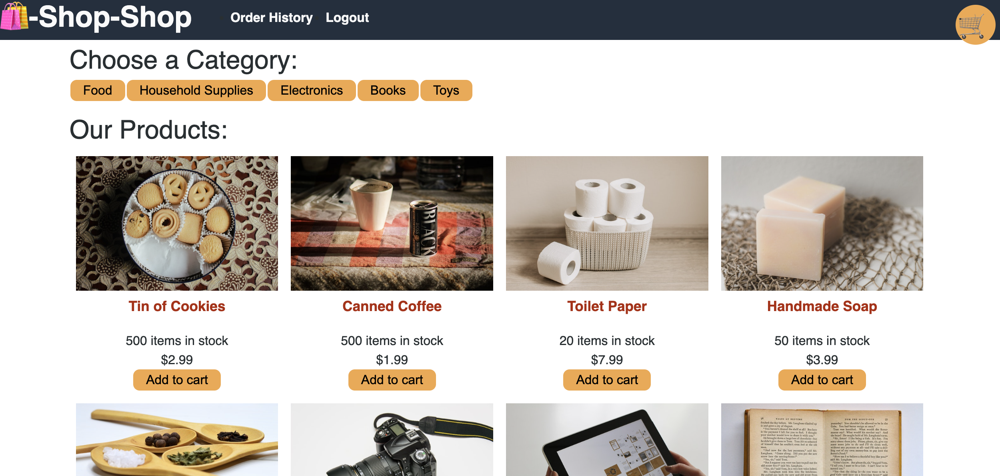

# Shop-Shop Redux

## Table of Contents

- [User Story](#user-story)
- [Description](#description)
- [Usage](#usage)
- [Requirements](#requirements)
- [Application](#application)
- [Questions](#questions)

## User Story

- AS a senior engineer working on an e-commerce platform
- I WANT my platform to use Redux to manage global state instead of the Context API
- SO THAT my website's state management is taken out of the React ecosystem

## Description

This MERN application uses Redux, IndexedDB, and secure online payments with Stripe to create a functional e-commerce app.

## Requirements

- GIVEN an e-commerce platform that uses Redux to manage global state
- WHEN I review the app’s store
- THEN I find that the app uses a Redux store instead of the Context API
- WHEN I review the way the React front end accesses the store
- THEN I find that the app uses a Redux provider
- WHEN I review the way the app determines changes to its global state
- THEN I find that the app passes reducers to a Redux store instead of using the Context API
- WHEN I review the way the app extracts state data from the store
- THEN I find that the app uses Redux instead of the Context API
- WHEN I review the way the app dispatches actions
- THEN I find that the app uses Redux instead of the Context API

## Application

[Link to deployed Application]()

## Questions?

For any questions, please email gilinamcbride@gmail.com, or visit any other projects on [Github](github.com/gilinamcbride).
